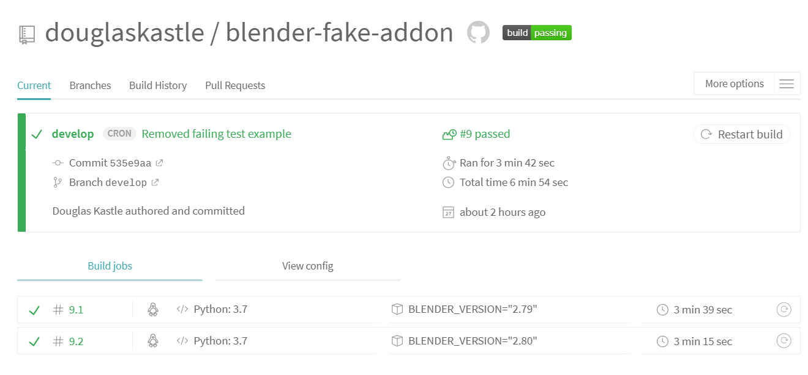
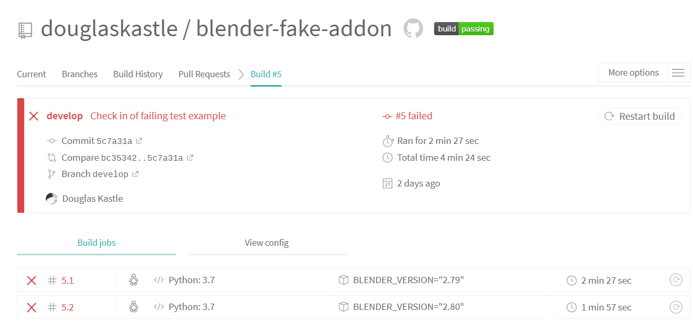

[](https://travis-ci.org/douglaskastle/blender-fake-addon)
[](https://github.com/douglaskastle/blender-fake-addon/actions)
[](https://codecov.io/gh/douglaskastle/blender-fake-addon)

# blender-fake-addon

This a working implementation of the [blender-addon-tester](https://pypi.org/project/blender-addon-tester/) which provides a test harness to enable the testing of addons written for blender. 

Once the module blender-addon-tester has been installed via pip it can be used to as a test harness.  `pytest` is used for tests, and testing can be run locally or against a continuous integration tool, CI, there is support for both Github Actions and Travis. 

## Install blender-addon-tester

`pip install -r blender_requirements.txt`

or you can install it explicltly: 

`pip install blender-addon-tester`

[blender-addon-tester is hosted on github](https://github.com/douglaskastle/blender-addon-tester)

## fake-addon

The addon included here, `fake-addon`, is the most basic addon possible.  All it does is print out a message when it is installed and another one when it is removed.  

However all addons are required to have version tuple.  This version ID of the addon can be read back through blender via python.  This is the test we use, written in `pytest` format:

```
    expect_version = (0, 0, 1)
    return_version = get_version(bpy_module)
    assert  expect_version == return_version
```

In the current release, there are two tests, one to check that the right value gets returned for the version ID and one to check if the wrong value returned is detected correctly.  These pass.  If you wish to see a correct failure under pytest, changed the `expect_version` value to something it should not be.

## Usage

Once `blender-addon-tester` is installed 

```
    import blender_addon_tester as BAT
    BAT.test_blender_addon(addon_path=addon, blender_revision=blender_rev)
```

where the name of the addon and the version of blender you wish to use is passed in. 

If the blender version has not been found locally it will download the most up to date version. Unpack and update that verison of blender to install the test harness modules.  

Then it installs the addon into this version of blender, in this case `fake_addon`. 

The test suite is executed. 

Finally when testing is over the result is reported and the addon is uninstalled from the local version of blender.

This has been encapsulated in a script that is used by the CI tools, but can also be run locally.

## Testing script

This script will download blender 2.82, install the fake_addon addon and run tests located in the `tests` directory:

`python scripts\test_addon.py fake_addon 2.82`

```
============================= test session starts =============================
platform win32 -- Python 3.7.4, pytest-5.4.1, py-1.8.1, pluggy-0.13.1 -- C:\blender\blender-2.82\blender.exe
cachedir: .pytest_cache
rootdir: C:\blender\blender-fake-addon
plugins: cov-2.8.1
collected 2 items

tests/test_version.py::test_versionID_pass PASSED                         [ 50%]
tests/test_version.py::test_versionID_fail PASSED                         [100%]

========================== 2 passed in 0.20 seconds ===========================
```

## TravisCI

To use TravisCI you need to link your github account.

Here is an example of a successful run:



And this was the result of a test that was checked in a a failure forced:



And here is what can be found in the log for the error.

```
_____________________________ test_versionID_pass ______________________________
bpy_module = 'fake_addon'
    def test_versionID_pass(bpy_module):
        expect_version = (1, 0, 1)
        return_version = get_version(bpy_module)
>       assert  expect_version == return_version
E       assert (1, 0, 1) == (0, 0, 1)
E         At index 0 diff: 1 != 0
E         Use -v to get the full diff
tests/test_pytest.py:11: AssertionError
====================== 1 failed, 1 passed in 0.08 seconds ======================
Cleaning up - fake_addon
Goodbye World
*** test run reporting finished
```
As we want to run against the nightly builds we need to set up some cronjobs to run.  These can be found under settings.  I added a daily cron for my builds as I imagine my addon isn't changing that much, it is a potential change in the how the nightly builds work is what we really want to catch early.


Please consult the `.travis.yml` file for the remainder of operation it is quite self explanitory.

## Github Actions

TBD

## Code Coverage

Supported
